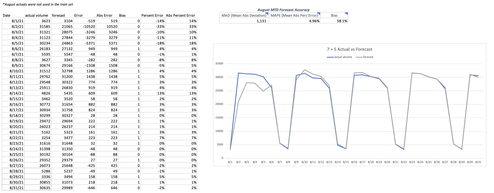

# Jeff Stevenson Portfolio
Data Analyst Portfolio
 

# Project 1: Department Goals
* Created goals for our operations department to establish performance management and assist with capacity planning.
* Combined quarterly projections with historical performance to help inform responsible targets for 500+ associates.
* Created performance buckets and definitions based on production that tied directly to compensation and quarterly reviews.
* Developed monthly and quarterly reporting to assist supervisors with performance management and ensure company targets were being met.
* Provided recommendations based on performance trends and business need.  

 

# Project 2: xTeam Call Reduction
* Supported a xTeam collaboration project to identify solutions for reducing non-value calls to key partners.
* Worked with teams including Product, Dev, Operational leaders and other key stakeholders to identify non-value work.
* Researched demographics of over 1M items to find which ones were more (or less) likely to be resolved regardless of if we made a call or not.
* Provided analysis and recommendations on which areas we could target, as well as testing support and self-service dashboards for monitoring changes.
* The change resulted in enhanced client relations, as well as a $150K per year efficiency gain for our operations department.

 

# [Project 3: Volume Forecasting](https://github.com/jeffstevenson90/kaggle/blob/main/cmm-tsf1.ipynb)
* Developed a daily forecast for projected work volume in Python to assist with capacity needs.
* Used a test and train set for predictions, also applied proprocessing principles such as feature transformation, encoding, and esembling.
* Model evaluation thus far: MAPE (9.3%) / Model Bias (32.3%)

 

# Project 4: Tableau Reports
* Examples of reports created in Tableau are below. 
*(data has been altered or standardized)*

 

 

